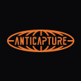
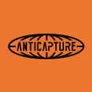
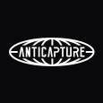

#  Anticapture Brand Kit 
**🌐 Mission**: Protect DAOs from security breaches
 
**🎯 Weapon**: Dashboard designed to neutralize attackers
 
🧰 Brand Kit: Official logos, fonts, colors, and usage guidelines
 
 

## Logo

| Color         | Full Logo (Primary)                                                                                                                                                                       | Full Logo w/ Background                                                                                                                                                                                    | Compact Logo (Secondary)                                                                                                                                                                                    | Compact w/ Background                                                                                                                                                                             |
| ------------- | ----------------------------------------------------------------------------------------------------------------------------------------------------------------------------------------- | ----------------------------------------------------------------------------------------------------------------------------------------------------------------------------------------------------------- | ----------------------------------------------------------------------------------------------------------------------------------------------------------------------------------------------------------- | ----------------------------------------------------------------------------------------------------------------------------------------------------------------------------------------------- |
| **Tangerine** | 
 [svg](logos/full-logo/full-logo-tangerine.svg) / [png](logos/full-logo/full-logo-tangerine.png)
 | 
 [svg](logos/full-logo/full-logo-tangerine-bg.svg) / [png](logos/full-logo/full-logo-tangerine-bg.png)
          | 
 [svg](logos/compact-logo/compact-logo-tangerine.svg) / [png](logos/full-logo/full-logo-tangerine.png)
 | 
 [svg](logos/compact-logo/compact-logo-tangerine-bg.svg) / [png](logos/compact-logo/compact-logo-tangerine-bg.png)
 |
| **Black**     | 
 [svg](logos/full-logo/full-logo-black.svg) / [png](logos/full-logo/full-logo-black.png)
             | 
 [svg](logos/full-logo/full-logo-black-bg.svg) / [png](logos/full-logo/full-logo-black-bg.png)
                      | 
 [svg](logos/compact-logo/compact-logo-black.svg) / [png](logos/compact-logo/compact-logo-black.png)
             | 
 [svg](logos/compact-logo/compact-logo-black-bg.svg) / [png](logos/compact-logo/compact-logo-black-bg.png)
             |
| **White**     | 
 [svg](logos/full-logo/full-logo-white.svg) / [png](logos/full-logo/full-logo-white.png)
             | 
 [svg](logos/full-logo/full-logo-white-bg.svg) / [png](logos/full-logo/full-logo-white-bg.png)
                      | 
 [svg](logos/compact-logo/compact-logo-white.svg) / [png](logos/compact-logo/compact-logo-white.png)
             | 
 [svg](logos/compact-logo/compact-logo-white-bg.svg) / [png](logos/compact-logo/compact-logo-white-bg.png)
             |

➡️ Usage
- Ensure strong contrast between the logo and the background to keep it easily visible and accessible in any context.
- To maintain clarity and impact, always provide enough clear space around the logo. Use the minimum recommended spacing on all sides.
  
|    Good constrast example   |      X = 1/3 of the logo’s height              |
|------------|-----------------------------------------------------------------|
|    | 
   |
|    | 
   |

 

## Palette
Tangerine, Black, and White are Anticapture’s signature colors. They can be used as both background and foreground elements. Charcoal is mainly reserved for backgrounds and typography.

| Color      | Swatch                                               | Hex Code  |
|------------|------------------------------------------------------|-----------|
| Tangerine  |  | `#EC762E` |
| Black      |  | `#09090B` |
| Charcoal   |  | `#18181B` |
| White      |  | `#FAFAFA` |

 

## Typography
The chosen typefaces support Anticapture’s visual identity with clarity and flexibility, offering both legibility and character.

| Font         | Usage                   | Example                                          |  Download |
|--------------|-------------------------|---------------------------------------           |-----------|
| Inter        | Body and headlines      |         |  
 [↗️](https://fonts.google.com/specimen/Inter) |
| Roboto Mono  |  Titles and headlines   |   | 
 [↗️](https://fonts.google.com/specimen/Roboto+Mono) |

 

## Iconography
Anticapture’s icons follow a custom pixel-art style that reflects the brand’s tech-forward identity. They are clear, minimal, and optimized for small sizes.
 
 
|  |   |   |  |  |  |    |   |    |   |  |  | 
|----------------------------|----------------------------|----------------------------|----------------------------|----------------------------|----------------------------| ----------------------------| ----------------------------|  ----------------------------| ----------------------------|----------------------------| ----------------------------|

